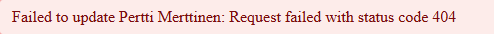

<div class="content">

Sovelluksemme ulkoasu on tällä hetkellä hyvin vaatimaton. Osaan 0 liittyvässä [tehtävässä 0.2](/osa0/web_sovelluksen_toimintaperiaatteita#tehtavia) tutustuttiin Mozillan [CSS-tutoriaaliin](https://developer.mozilla.org/en-US/docs/Learn/Getting_started_with_the_web/CSS_basics).

Katsotaan vielä tämän osan lopussa nopeasti kahta tapaa liittää tyylejä React-sovellukseen. Tapoja on useita, ja tulemme tarkastelemaan muita myöhemmin. Ensimmäisenä liitämme CSS:n sovellukseemme vanhan kansan tapaan yksittäisenä tiedostona, joka on kirjoitettu käsin ilman [esiprosessorien](https://developer.mozilla.org/en-US/docs/Glossary/CSS_preprocessor) apua (tulemme myöhemmin huomaamaan, että tämä ei ole täysin totta).

Tehdään sovelluksen hakemistoon <i>src</i> tiedosto <i>index.css</i> ja liitetään se sovellukseen lisäämällä tiedostoon <i>main.jsx</i> seuraava import:

```js
import './index.css'
```

Lisätään seuraava sääntö tiedostoon <i>index.css</i>:

```css
h1 {
  color: green;
}
```

CSS-säännöt koostuvat valitsimesta eli <i>selektorista</i> ja määrittelystä eli <i>deklaraatiosta</i>. Valitsin määrittelee, mihin elementteihin sääntö kohdistuu. Valitsimena on nyt <i>h1</i> eli kaikki sovelluksessa käytetyt <i>h1</i>-otsikkotägit.

Määrittelyosa asettaa ominaisuuden _color_ eli fontin värin arvoksi vihreän (<i>green</i>).

Sääntö voi sisältää mielivaltaisen määrän määrittelyjä. Muutetaan edellistä siten, että tekstistä tulee kursivoitua eli fontin tyyliksi asetetaan <i>italic</i>:

```css
h1 {
  color: green;
  font-style: italic;  // highlight-line
}
```

Erilaisia selektoreja eli tapoja valita tyylien kohde on [lukuisia](https://developer.mozilla.org/en-US/docs/Web/CSS/CSS_Selectors).

Jos haluamme kohdistaa tyylejä esim. jokaiseen muistiinpanoon, voisimme käyttää selektoria <i>li</i>, sillä muistiinpanot ovat <i>li</i>-tagien sisällä:

```js
const Note = ({ note, toggleImportance }) => {
  const label = note.important 
    ? 'make not important' 
    : 'make important'

  return (
    <li>
      {note.content} 
      <button onClick={toggleImportance}>{label}</button>
    </li>
  )
}
```

Lisätään tyylitiedostoon seuraava (koska osaamiseni tyylikkäiden web-sivujen tekemiseen on lähellä nollaa, nyt käytettävissä tyyleissä ei ole sinänsä mitään järkeä):

```css
li {
  color: grey;
  padding-top: 3px;
  font-size: 15px;
}
```

Tyylien kohdistaminen elementtityyppeihin on kuitenkin ongelmallista. Jos sovelluksessa on myös muita <i>li</i>-tageja, kaikki saavat samat tyylit.

Jos haluamme kohdistaa tyylit nimenomaan muistiinpanoihin, on parempi käyttää [class selectoreja](https://developer.mozilla.org/en-US/docs/Web/CSS/Class_selectors).

Normaalissa HTML:ssä luokat määritellään elementtien attribuutin <i>class</i> arvona:

```html
<li class="note">tekstiä</li>
```

Reactissa tulee kuitenkin classin sijaan käyttää attribuuttia [className](https://react.dev/learn#adding-styles), joten muutetaan komponenttia <i>Note</i> seuraavasti:

```js
const Note = ({ note, toggleImportance }) => {
  const label = note.important 
    ? 'make not important' 
    : 'make important'

  return (
    <li className='note'> // highlight-line
      {note.content} 
      <button onClick={toggleImportance}>{label}</button>
    </li>
  )
}
```

Luokkaselektori määritellään syntaksilla _.classname_ eli:

```css
.note {
  color: grey;
  padding-top: 5px;
  font-size: 15px;
}
```

Jos nyt lisäät sovellukseen muita li-elementtejä, ne eivät saa muistiinpanoille määriteltyjä tyylejä.

### Parempi virheilmoitus

Aiemmin toteutimme olemassa olemattoman muistiinpanon tärkeyden muutokseen liittyvän virheilmoituksen <em>alert</em>-metodilla. Toteutetaan se nyt Reactilla omana komponenttinaan tiedostossa <i>src/components/Notification.jsx</i>.

Komponentti on yksinkertainen:

```js
const Notification = ({ message }) => {
  if (message === null) {
    return null
  }

  return (
    <div className="error">
      {message}
    </div>
  )
}

export default Notification
```

Jos propsin <em>message</em> arvo on <em>null</em>, ei renderöidä mitään. Muussa tapauksessa renderöidään viesti div-elementtiin. Elementille on liitetty tyylien lisäämistä varten luokka <i>error</i>.

Lisätään komponentin <i>App</i> tilaan kenttä <i>errorMessage</i> virheviestiä varten. Laitetaan kentälle heti jotain sisältöä, jotta pääsemme testaamaan komponenttia:

```js
import { useState, useEffect } from 'react'
import Note from './components/Note'
import noteService from './services/notes'
import Notification from './components/Notification' // highlight-line

const App = () => {
  const [notes, setNotes] = useState([]) 
  const [newNote, setNewNote] = useState('')
  const [showAll, setShowAll] = useState(true)
  const [errorMessage, setErrorMessage] = useState('some error happened...') // highlight-line

  // ...

  return (
    <div>
      <h1>Notes</h1>
      <Notification message={errorMessage} /> // highlight-line
      <div>
        <button onClick={() => setShowAll(!showAll)}>
          show {showAll ? 'important' : 'all' }
        </button>
      </div>      
      // ...
    </div>
  )
}
```

Lisätään sitten virheviestille sopiva tyyli:

```css
.error {
  color: red;
  background: lightgrey;
  font-size: 20px;
  border-style: solid;
  border-radius: 5px;
  padding: 10px;
  margin-bottom: 10px;
}
```

Nyt olemme valmiina lisäämään virheviestin logiikan. Muutetaan metodia <em>toggleImportanceOf</em> seuraavasti:

```js
  const toggleImportanceOf = id => {
    const note = notes.find(n => n.id === id)
    const changedNote = { ...note, important: !note.important }

    noteService
      .update(id, changedNote).then(returnedNote => {
        setNotes(notes.map(note => note.id !== id ? note : returnedNote))
      })
      .catch(error => {
        // highlight-start
        setErrorMessage(
          `Note '${note.content}' was already removed from server`
        )
        setTimeout(() => {
          setErrorMessage(null)
        }, 5000)
        // highlight-end
        setNotes(notes.filter(n => n.id !== id))
      })
  }
```

Virheen yhteydessä asetetaan tilaan <em>errorMessage</em> sopiva virheviesti. Samalla käynnistetään ajastin, joka asettaa viiden sekunnin kuluttua tilan <em>errorMessage</em>-kentän arvoksi <em>null</em>.

Lopputulos näyttää seuraavalta:


Sovelluksen tämänhetkinen koodi on kokonaisuudessaan [GitHubissa](https://github.com/fullstack-hy2020/part2-notes-frontend/tree/part2-7), branchissa <i>part2-7</i>.

### Inline-tyylit

React mahdollistaa tyylien kirjoittamisen myös suoraan komponenttien koodin joukkoon niin sanoittuina [inline-tyyleinä](https://react-cn.github.io/react/tips/inline-styles.html).

Periaate inline-tyylien määrittelyssä on erittäin yksinkertainen. Mihin tahansa React-komponenttiin tai elementtiin voi liittää attribuutin [style](https://react.dev/reference/react-dom/components/common#applying-css-styles), jolle annetaan arvoksi JavaScript-oliona määritelty joukko CSS-sääntöjä.

CSS-säännöt määritellään JavaScriptin avulla hieman eri tavalla kuin normaaleissa CSS-tiedostoissa. Jos haluamme asettaa jollekin elementille esimerkiksi vihreän ja kursivoidun fontin, määrittely ilmaistaan CSS-syntaksilla seuraavasti:

```css
{
  color: green;
  font-style: italic;
}
```

Vastaava tyyli kirjoitetaan Reactin inline-tyylin määrittelevänä oliona seuraavasti:

```js
{
  color: 'green',
  fontStyle: 'italic'
}
```

Jokainen CSS-sääntö on olion kenttä, joten ne erotetaan JavaScript-syntaksin mukaan pilkuilla. Pikseleinä ilmaistut numeroarvot voidaan määritellä kokonaislukuina. Merkittävin ero normaaliin CSS:ään on väliviivan sisältämien CSS-ominaisuuksien kirjoittaminen camelCase-muodossa.

Lisätään sovellukseemme alapalkin muodostava komponentti <i>Footer</i> ja määritellään sille inline-tyylit. Määritellään komponentti tiedostossa _components/Footer.jsx_ otetaan se käyttöön tiedostossa _App.jsx_ seuraavasti:

```js
const Footer = () => {
  const footerStyle = {
    color: 'green',
    fontStyle: 'italic'
  }

  return (
    <div style={footerStyle}>
      <br />
      <p>
        Note app, Department of Computer Science, University of Helsinki 2025
      </p>
    </div>
  )
}

export default Footer
```

```js
import { useState, useEffect } from 'react'
import Footer from './components/Footer' // highlight-line
import Note from './components/Note'
import Notification from './components/Notification'
import noteService from './services/notes'

const App = () => {
  // ...

  return (
    <div>
      <h1>Notes</h1>

      <Notification message={errorMessage} />

      // ...  

      <Footer /> // highlight-line
    </div>
  )
}
```

Inline-tyyleillä on tiettyjä rajoituksia, esim. ns. pseudo-selektoreja ei ole mahdollisuutta käyttää (ainakaan helposti).

Inline-tyylit ja muutamat myöhemmin kurssilla katsomamme tavat lisätä tyylejä Reactiin ovat periaatteessa täysin vastoin vanhoja hyviä periaatteita, joiden mukaan web-sovellusten ulkoasujen määrittely eli CSS tulee erottaa sisällön (HTML) ja toiminnallisuuden (JavaScript) määrittelystä. Vanha koulukunta pyrkiikin siihen, että sovelluksen CSS, HTML ja JavaScript kirjoitetaan omiin tiedostoihinsa.

CSS:n, HTML:n ja JavaScriptin erottelu omiin tiedostoihinsa ei kuitenkaan ole välttämättä erityisen skaalautuva ratkaisu suurissa ohjelmistoissa. Reactissa onkin periaatteena jakaa sovelluksen koodi eri tiedostoihin noudattaen sovelluksen loogisia toiminnallisia kokonaisuuksia.

Toiminnallisen kokonaisuuden strukturointiyksikkö on React-komponentti, joka määrittelee niin sisällön rakenteen kuvaavan HTML:n, toiminnan määrittelevät JavaScript-funktiot kuin komponentin tyylinkin yhdessä paikassa siten, että komponenteista tulee mahdollisimman riippumattomia ja yleiskäyttöisiä.

Sovelluksen lopullinen koodi on kokonaisuudessaan [GitHubissa](https://github.com/fullstack-hy2020/part2-notes-frontend/tree/part2-8), branchissa <i>part2-8</i>.

</div>

<div class="tasks">

<h3>Tehtävät 2.16.-2.17.</h3>

<h4>2.16: puhelinluettelo step11</h4>

Toteuta osan 2 esimerkin [parempi virheilmoitus](/osa2/tyylien_lisaaminen_react_sovellukseen#parempi-virheilmoitus) tyyliin ruudulla muutaman sekunnin näkyvä ilmoitus, joka kertoo onnistuneista operaatioista (henkilön lisäys ja poisto sekä numeron muutos):


<h4>Copilot-ohjeet tehtävälle</h4>

Luo ensin tyhjä index.css-tiedosto src-kansioon.

Kirjoitetaan nyt ensimmäiset CSS-luokat. Avaa tiedosto ja kirjoita Copilotille:

```text
Määrittele index.css .alert-success -luokka, pidä tyyli simppelinä ja käytä vihreää väriä.
```

```text
Luo index.css .alert-error -luokka samaan tyyliin kuin .alert-success, mutta käytä punaista väriä.
Importoi tyylit App.jsx-tiedostoon.
```

Seuraavaksi luodaan uusi Notification-komponentti:

```text
Luo Notification-komponentti components-kansioon.
Propsit: message, type ("success" tai "error") ja onClose (callback).
Hallitaan tilaa myöhemmin App.jsx:ssä.
Näytä viesti ruudulla käyttäen .alert-success tai .alert-error CSS-luokkaa type:n mukaan. (CSS-luokat löytyvät src/index.css)
Viestin tulee hävitä automaattisesti 5 sekunnin kuluttua.
```

Lisätään App.jsx-tiedostoon Notification-komponentti ja kaksi uutta tilaa:

```text
Muokkaa App.jsx:ää siten, että Notification-komponentti näyttää viestin seuraavissa tilanteissa:

- Kun uusi henkilö lisätään, aseta message="Added {name}" ja type="success".
- Kun olemassa olevan henkilön numero päivitetään, aseta message="Updated {name}'s number" ja type="success".
- Kun henkilö poistetaan, aseta message="Deleted {name}" ja type="success".
- Käytä handleSubmit ja handleDelete kohtia, jotta notificationMessage ja notificationType-state päivittyvät.
- Säilytä varmistus window.confirm
```

```text
Lisää App.jsx-tiedostoon kaksi uutta tilaa: notificationMessage (alkuarvo null) ja notificationType (alkuarvo 'success'). Tuo Notification-komponentti ja renderöi se <h2>Phonebook</h2>-otsikon alapuolelle. Välitä sille propseina message, type sekä onClose-funktio, joka asettaa notificationMessage-tilan takaisin null-arvoksi.
```

Tämän jälkeen luodaan apufunktio, jota kutsutaan kun toiminto onnistuu:

```text
Luo App.jsx-tiedostoon apufunktio showMessage(message, type = 'success'). Funktio asettaa viestin ja tyypin niille varattuihin tiloihin. Tämän jälkeen voit kutsua tätä yhtä funktiota kaikissa onnistuneissa operaatioissa.
```

Lisätään vielä viestit lisäys-, päivitys- ja poistotoimintoihin:

```text
Päivitä addPerson ja handleDelete -funktiot käyttämään showMessage-funktiota:

1. Kun uusi henkilö luodaan (.create).

2. Kun numero päivitetään (.updatePersonNumber).

3. Kun henkilö poistetaan onnistuneesti (.deletePerson). Käytä viesteissä henkilön nimeä, esim. 'Added {name}'."
```

Lopuksi lisätään vielä virheille notifikaatiot.

Avaa App.jsx ja kirjoita Copilotille:

```text
Korvaa catch-osioissa olevat alertit Notification-komponentin tilamuutoksella. Aseta tilanteeseen sopiva teksti ja muista käyttää type="error".
```

Sammuta taas JSON-serveri ja kokeile poistaa henkilö.

Punaisen Notification-komponentin pitäisi nyt ilmestyä ruudulle.

<h4>2.17*: puhelinluettelo step12</h4>

Avaa sovelluksesi kahteen selaimeen. **Jos poistat jonkun henkilön selaimella 1** hieman ennen kuin yrität <i>muuttaa henkilön numeroa</i> selaimella 2, tapahtuu virhetilanne:


Korjaa ongelma osan 2 esimerkin [promise ja virheet](/osa2/palvelimella_olevan_datan_muokkaaminen#promise-ja-virheet) hengessä ja siten, että käyttäjälle ilmoitetaan operaation epäonnistumisesta. Onnistuneen ja epäonnistuneen operaation ilmoitusten tulee erota toisistaan: 


**HUOM**: Vaikka käsittelet poikkeuksen koodissa, virheilmoitus tulostuu silti konsoliin.

<h4>Copilot-ohjeet tehtävälle</h4>

Meidän versiossamme olemme jo elegantisti käsitelleet mahdolliset virheet try-catch -rakenteella.
Jos teemme tehtävänannon mukaisen virheen, saamme seuraavan Notification-komponentin ruudulle:



tai jonkun vastaavan virheilmoituksen.

Voimme kuitenkin hieman parantaa tätä.
Huomaamme, että palautuva statuskoodi on 404, tämä tunnetusti tarkoittaa "Not found", eli kyseistä henkilöä ei ole enää JSON-serverillä.
Sovelluksemme ei kuitenkaan päivitä persons-tilaa, vaan edelleen jo muualla poistettu henkilö näkyy sovelluksessa.

Korjataan tämä kirjoittamalla Copilotille:

```text
Korjaa handleSubmit- ja handleDelete-funktiot siten, että jos serveriltä palautuu 404 (henkilöä ei löydy), sovellus:

- Näyttää Notification-komponentilla virheilmoituksen, esim. `Information of ${name} has already been removed from server` tyyppi="error".
- Päivittää persons-tilan poistamalla henkilön, joka ei enää ole serverillä.

Säilytä muu toiminnallisuus täysin ennallaan.
```

Aiheuta yllä mainittu virhetilanne uudestaan, nyt jo poistetun henkilön pitäisi myös poistua ruudulta.

</div>

<div class="content">

### Muutama tärkeä huomio

Osan lopussa on vielä muutama hieman haastavampi tehtävä. Voit tässä vaiheessa jättää tehtävät tekemättä jos ne tuottavat liian paljon päänvaivaa, palaamme samoihin teemoihin uudelleen myöhemmin. Materiaali kannattanee jokatapauksessa lukea läpi.

Eräs sovelluksessa tekemämme ratkaisu piilottaa yhden hyvin tyypillisen virhetilanteen, mihin tulet varmasti törmäämään monta kertaa.

Alustimme muistiinpanot muistavan tilan alkuarvoksi tyhjän taulukon:

```js
const App = () => {
  const [notes, setNotes] = useState([])

  // ...
}
```

Tämä onkin luonnollinen tapa alustaa tila, muistiinpanot muodostavat joukon, joten tyhjä taulukko on luonteva alkuarvo muuttujalle.

Niissä tilanteissa, missä tilaan talletetaan "yksi asia" tilan luonteva alkuarvo on usein _null_, joka kertoo että tilassa ei ole vielä mitään. Kokeillaan miten käy jos alustamme nyt tilan nulliksi: 

```js
const App = () => {
  const [notes, setNotes] = useState(null) // highlight-line

  // ...
}
```

Sovellus hajoaa:


Virheilmoitus kertoo vian syyn ja sijainnin. Ongelmallinen kohta on seuraava:

```js
  // notesToShow gets the value of notes
  const notesToShow = showAll
    ? notes
    : notes.filter(note => note.important)

  // ...

  {notesToShow.map(note =>  // highlight-line
    <Note key={note.id} note={note} />
  )}
```

Virheilmoitus siis on

```
Cannot read properties of null (reading 'map')
```

Muuttuja _notesToShow_ saa arvokseen tilan _notes_ arvon ja koodi yrittää kutsua olemattomalle oliolle (jonka arvo on null) metodia <i>map</i>. 

Mistä tämä johtuu?

Effect-hook asettaa tilaan _notes_ palvelimen palauttamat muistiinpanot funktiolla _setNotes_:

```js
  useEffect(() => {
    noteService
      .getAll()
      .then(initialNotes => {
        setNotes(initialNotes)  // highlight-line
      })
  }, [])
```

Ongelma on kuitenkin siinä, että efekti suoritetaan vasta <i>ensimmäisen renderöinnin jälkeen</i>. Koska tilalle _notes_ on asetettu alkuarvo null:

```js
const App = () => {
  const [notes, setNotes] = useState(null) // highlight-line

  // ...
```

ensimmäisen renderöinnin tapahtuessa tullaan suorittamaan

```js
notesToShow = notes

// ...

notesToShow.map(note => ...)
```

ja tämä aiheuttaa ongelman, sillä arvolle _null_ ei voida kutsua metodia _map_. 

Kun annoimme tilalle _notes_ alkuarvoksi tyhjän taulukon, ei samaa ongelmaa esiinny, tyhjälle taulukolle on luvallista kutsua metodia _map_.

Sopiva tilan alustaminen siis "peitti" ongelman, joka johtuu siitä että muistiinpanoja ei ole vielä alustettu palvelimelta haettavalla datalla.

Toinen tapa kiertää ongelma on tehdä <i>ehdollinen renderöinti</i>, ja palauttaa ainoastaan _null_ jos komponentin tila ei ole vielä alustettu:

```js
const App = () => {
  const [notes, setNotes] = useState(null) // highlight-line
  // ... 

  useEffect(() => {
    noteService
      .getAll()
      .then(initialNotes => {
        setNotes(initialNotes)
      })
  }, [])

  // do not render anything if notes is still null
  // highlight-start
  if (!notes) { 
    return null 
  }
  // highlight-end

  // ...
} 
```

Nyt ensimmäisellä renderöinnillä ei renderöidä mitään. Kun muistiinpanot saapuvat palvelimelta, asetetaan ne tilaan _notes_ kutsumalla funktiota _setNotes_. Tämä saa aikaan uuden renderöinnin ja muistiinpanot piirtyvät ruudulle.

Tämä tapa sopii erityisesti niihin tilanteisiin, joissa tilaa ei voi alustaa muuten komponentille sopivaan, renderöinnin mahdollistavaan alkuarvoon kuten tyhjäksi taulukoksi.

Toinen huomiomme liittyy useEffectin toiseen parametriin:

```js
  useEffect(() => {
    noteService
      .getAll()
      .then(initialNotes => {
        setNotes(initialNotes)  
      })
  }, []) // highlight-line
```

Funktion <em>useEffect</em> toista parametria käytetään [tarkentamaan sitä, miten usein efekti suoritetaan](https://react.dev/reference/react/useEffect#parameters). Periaate on se, että efekti suoritetaan aina ensimmäisen renderöinnin yhteydessä <i>ja</i> silloin kuin toisena parametrina olevan taulukon sisältö muuttuu.

Kun toisena parametrina on tyhjä taulukko <em>[]</em>, sen sisältö ei koskaan muutu ja efekti suoritetaan ainoastaan komponentin ensimmäisen renderöinnin jälkeen. Tämä on juuri se mitä haluamme kun alustamme sovelluksen tilan.

On kuitenkin tilanteita, missä efekti halutaan suorittaa muulloinkin, esim. komponentin tilan muuttuessa sopivalla tavalla.

Tarkastellaan seuraavaa yksinkertaista sovellusta, jonka avulla voidaan kysellä valuuttojen vaihtokursseja [Exchange rate API](https://www.exchangerate-api.com/) ‑palvelusta:

```js
import { useState, useEffect } from 'react'
import axios from 'axios'

const App = () => {
  const [value, setValue] = useState('')
  const [rates, setRates] = useState({})
  const [currency, setCurrency] = useState(null)

  useEffect(() => {
    console.log('effect run, currency is now', currency)

    // skip if currency is not defined
    if (currency) {
      console.log('fetching exchange rates...')
      axios
        .get(`https://open.er-api.com/v6/latest/${currency}`)
        .then(response => {
          setRates(response.data.rates)
        })
    }
  }, [currency])

  const handleChange = (event) => {
    setValue(event.target.value)
  }

  const onSearch = (event) => {
    event.preventDefault()
    setCurrency(value)
  }

  return (
    <div>
      <form onSubmit={onSearch}>
        currency: <input value={value} onChange={handleChange} />
        <button type="submit">exchange rate</button>
      </form>
      <pre>
        {JSON.stringify(rates, null, 2)}
      </pre>
    </div>
  )
}
```

Sovelluksen käyttöliittymässä on lomake, jonka syötekenttään halutun valuutan nimi kirjoitetaan. Jos valuutta on olemassa, renderöi sovellus valuutan vaihtokurssit muihin valuuttoihin:


Sovellus asettaa käyttäjän hakulomakkeelle kirjoittaman valuutan nimen tilaan _currency_ sillä hetkellä kun nappia painetaan. 

Kun _currency_ saa uuden arvon, sovellus tekee useEffectin määrittelemässä funktiossa haun valuuttakurssit kertovaan rajapintaan:

```js
const App = () => {
  // ...
  const [currency, setCurrency] = useState(null)

  useEffect(() => {
    console.log('effect run, currency is now', currency)

    // skip if currency is not defined
    if (currency) {
      console.log('fetching exchange rates...')
      axios
        .get(`https://open.er-api.com/v6/latest/${currency}`)
        .then(response => {
          setRates(response.data.rates)
        })
    }
  }, [currency]) // highlight-line
  // ...
}
```

Efektifunktio siis suoritetaan ensimmäisen renderöinnin jälkeen, ja <i>aina</i> sen jälkeen kun sen toisena parametrina oleva taulukko eli esimerkin tapauksessa _[currency]_ muuttuu. Eli kun tila _currency_ saa uuden arvon, muuttuu taulukon sisältö ja efektifunktio suoritetaan.

On luontevaa valita muuttujan _currency_ alkuarvoksi _null_, koska _currency_ kuvaa yksittäistä asiaa. Alkuarvo _null_ kertoo, että tilassa ei ole vielä mitään, ja tällöin on myös helppo tarkistaa yksinkertaisella if-lauseella, onko muuttujalle asetettu arvoa. Efektiin on tehty ehto

```js
if (currency) { 
  // haetaan valuuttakurssit
}
```

joka estää valuuttakurssien hakemisen ensimmäisen renderöinnin yhteydessä, eli siinä vaiheessa kun muuttujalla _currency_ on vasta alkuarvo _null_. 

Jos käyttäjä siis kirjoittaa hakukenttään esim. <i>eur</i>, suorittaa sovellus Axiosin avulla HTTP GET ‑pyynnön osoitteeseen https://open.er-api.com/v6/latest/eur ja tallentaa vastauksen tilaan _rates_. 

Kun käyttäjä tämän jälkeen kirjoittaa hakukenttään jonkin toisen arvon, esim. <i>usd</i> suoritetaan efekti jälleen ja uuden valuutan kurssit haetaan.

Tässä esitelty tapa API-kyselyjen tekemiseen saattaa tuntua hieman hankalalta. 
Tämä kyseinen sovellus olisikin voitu tehdä kokonaan ilman useEffectin käyttöä, ja tehdä API-kyselyt suoraan lomakkeen napin painamisen hoitavassa käsittelijäfunktiossa:

```js
  const onSearch = (event) => {
    event.preventDefault()
    axios
      .get(`https://open.er-api.com/v6/latest/${value}`)
      .then(response => {
        setRates(response.data.rates)
      })
  }
```

On kuitenkin tilanteita, missä vastaava tekniikka ei onnistu. Esim. eräs tapa tehtävässä 2.20 tarvittavien kaupungin säätietojen hakemiseen on nimenomaan useEffectin hyödyntäminen. Tehtävässä selviää myös hyvin ilman kyseistä kikkaa, esim. malliratkaisu ei sitä tarvitse.

</div>

<div class="tasks">

<h3>Tehtävät 2.18.-2.20.</h3>

<h4>2.18* maiden tiedot, step1</h4>

Siirrytään osan lopuksi hieman toisenlaiseen teemaan.

Osoitteesta [https://studies.cs.helsinki.fi/restcountries/](https://studies.cs.helsinki.fi/restcountries/) löytyy palvelu, joka tarjoaa paljon eri maihin liittyvää tietoa koneluettavassa muodossa ns. REST API:n välityksellä. Tee sovellus, jonka avulla voit tarkastella eri maiden tietoja.

Sovelluksen käyttöliittymä on yksinkertainen. Näytettävä maa haetaan kirjoittamalla hakuehto hakukenttään.

Jos ehdon täyttäviä maita on liikaa (yli kymmenen), kehotetaan tarkentamaan hakuehtoa:


Jos maita on kymmenen tai alle mutta enemmän kuin yksi, näytetään hakuehdon täyttävät maat:


Kun ehdon täyttäviä maita on enää yksi, näytetään maan perustiedot, lippu sekä maassa puhutut kielet:


**Huom1:** Riittää, että sovelluksesi toimii suurimmalle osalle maista. Jotkut maat kuten Sudan voivat tuottaa ongelmia, sillä maan nimi on toisen maan (South Sudan) osa. Näistä corner caseista ei tarvitse välittää.

**Huom2:** Saatat törmätä ongelmiin tässä tehtävässä, jos määrittelet komponentteja "väärässä paikassa". Nyt kannattaakin ehdottomasti kerrata edellisen osan luku [älä määrittele komponenttia komponentin sisällä](/osa1/monimutkaisempi_tila_reactin_debuggaus#ala-maarittele-komponenttia-komponentin-sisalla).

<h4>Copilot-ohjeet tehtävälle</h4>

Aloitetaan ensin luomalla App-komponentti, joka sisältää filter ja countries -tilat.

Avaa tyhjä App.jsx-tiedosto ja kirjoita Copilotille:

```text
Luo App-komponentti filter- ja countries-stateilla. Palauttaa tyhjän div-elementin.
```

Seuraavaksi lisätään input-kenttä maiden hakua varten:

```text
Luo input-kenttä, joka päivittää filter-tilaa. Erillinen onFilterChange-käsittelijä.
```

Tämän jälkeen luo kansio komponenteille ja tee sinne uusi Filter-komponentti. Refaktoroi juuri luotu input-kenttä Filter-komponentiksi. Jos et muista miten tämä tehtiin, palaa tehtävään 2.9.

Kun olet saanut App-komponentin käyttämään Filter-komponenttia, on aika hakea maat API:sta.

Avaa App.jsx ja kirjoita Copilotille:

```text
Luo useEffect-hook, joka tekee GET-pyynnön osoitteeseen d ja asettaa maat countries-taulukkoon.
```

Nyt maat haetaan API:sta ja asetetaan countries-taulukkoon, mutta taulukon sisältöä ei vielä renderöidä.

Seuraavaksi haluamme heti refaktoroida ulkoisen API:n kanssa kommunikoinnin omaan tiedostoon.

Luo uusi services-kansio ja sinne tiedosto countryService.js. Refaktoroi GET-pyyntö tiedostoon getAll()-funktioon ja ota se käyttöön App.jsx-tiedostossa.

Jos et muista miten tämä tehdään, palaa tehtävään 2.13.

Kun olet saanut tämän tehtyä, voimme tehdä filtteröinti-toiminnon valmiiksi.

Kirjoita Copilotille:

```text
Filtteröi maat filter-tilan perusteella ja aseta ne countriesToShow-muuttujaan.
```

Nyt voimme renderöidä countriesToShow-taulukon, jos tuloksia on alle 10:

```text
Renderöi ehdollisesti countriesToShow, jos niitä on alle 10 kappaletta. Jos maita on yli 10 renderöi teksti "Too many matches".
```

Seuraavaksi luodaan tästä oma komponentti CountryList. Komponentti saa propsina taulukon maita (countriesToShow-muuttuja) ja tarkistaa onko maita alle 10. Ehdollisella renderöinnillä näyttää joko listan maista tai "Too many matches"-tekstin.

Kun tämä on tehty, haluamme näyttää tarkempia tietoja maasta, jos tuloksia on tasan yksi:

```text
Jos countries.length on tasan 1 näytä maan nimi, pääkaupunki, pinta-ala, kielet (listana) ja lippu (country.flags.png).
```

Copilot teki nyt CountryList-komponenttiin:

```jsx
if (countries.length === 1) {
  ... ... ...
}
```

Haluamme eriyttää tämän heti omaan komponenttiin CountryDetails, eli refaktoroinnin jälkeen ehtolauseen sisältö pitäisi olla:

```jsx
if (countries.length === 1) {
  return <CountryDetails country={countries[0]} >
}
```

<h4>2.19*: maiden tiedot, step2</h4>

**Tässä osassa on vielä paljon tekemistä, joten älä juutu tähän tehtävään!**

Paranna edellisen tehtävän maasovellusta siten, että kun sivulla näkyy useiden maiden nimiä, tulee maan nimen viereen nappi, jota klikkaamalla pääsee suoraan maan näkymään:


Tässäkin tehtävässä riittää, että ohjelmasi toimii suurella osalla maita ja maat, joiden nimi sisältyy johonkin muuhun maahan (kuten Sudan) voit unohtaa. 

<h4>Copilot-ohjeet tehtävälle</h4>

Lisätään ensin App-komponenttiin selectedCountry-tila:

```text
Lisää App.jsx-tiedostoon uusi tila selectedCountry (alkuarvo null).
```

Seuraavaksi lisätään 'show'-nappi maiden viereen:

```text
Päivitä CountryList-komponenttia siten, että jokaisen maan nimen viereen tulee 'show'-painike. Älä tee muuta.
```

Nyt maiden vieressä on painike, joka ei tee vielä mitään. Lisätään seuraavaksi napille handleri ja annetaan se propsina CountryList-komponentille:

```text
Lisää App.jsx-tiedostoon handleri "show"-napille ja lähetä se propsina CountryList-komponentille ja ota se napissa käyttöön. Handler asettaa maan olion selectedCountry-tilaan.
```

Seuraavaksi lisätään ehdollinen maan tietojen näyttäminen:

```text
Muuta App.jsx-renderöintiä siten, että jos selectedCountry on asetettu, näytetään vain CountryDetails-komponentti kyseiselle maalle. Tämä näkymä ohittaa tavallisen listauksen.
```

Lopuksi haluamme vielä "back"-napin CountryDetails-komponenttiin:

```text
Lisää CountryDetails-komponentin yläpuolelle 'back'-painike, joka tyhjentää selectedCountry-tilan.
```

<h4>2.20*: maiden tiedot, step3</h4>


Lisää yksittäisen maan näkymään pääkaupungin säätiedotus. Säätiedotuksen tarjoavia palveluita on kymmeniä. Itse käytin [https://openweathermap.org/](https://openweathermap.org/):ia. Huomaa että api-avaimen luomisen jälkeen saattaa kulua hetki ennen kuin avain alkaa toimia.


Jos käytät Open weather mapia, [täällä](https://openweathermap.org/weather-conditions#Icon-list) on ohje sääikonien generointiin.

**Huom:** Tarvitset melkein kaikkia säätietoja tarjoavia palveluja käyttääksesi API-avaimen. Älä talleta avainta versionhallintaan eli älä kirjoita avainta suoraan koodiin. Avaimen arvo kannattaa tässä tehtävässä määritellä ns. [ympäristömuuttujana](https://vitejs.dev/guide/env-and-mode.html). Todellisissa sovelluksissa avaimien lähettäminen suoraan selaimesta ei kuitenkaan ole suositeltavaa, koska tällöin kuka tahansa sovelluksen käyttäjä voi saada API-avaimen tietoonsa. Käsittelemme erillisen backendin toteuttamista kurssin seuraavassa osassa. 

Oletetaan että API-avaimen arvo on <i>54l41n3n4v41m34rv0</i>. Kun ohjelma käynnistetään seuraavasti

```bash
export VITE_SOME_KEY=54l41n3n4v41m34rv0 && npm run dev // Linux/macOS Bash
($env:VITE_SOME_KEY="54l41n3n4v41m34rv0") -and (npm run dev) // Windows PowerShell
set "VITE_SOME_KEY=54l41n3n4v41m34rv0" && npm run dev // Windows cmd.exe
```

koodista päästään avaimen arvoon käsiksi olion _import.meta.env_ kautta:

```js
const api_key = import.meta.env.VITE_SOME_KEY
// muuttujassa api_key on nyt käynnistyksessä annettu API-avaimen arvo
```

Huomaa, että ympäristömuuttujan nimen täytyy alkaa merkkijonolla <i>VITE_</i>. 

Muista myös, että jos teet muutoksia ympäristömuuttujiin, sinun on käynnistettävä kehityspalvelin uudelleen, jotta muutokset tulevat voimaan.

Tämä oli osan viimeinen tehtävä ja on aika sekä puskea koodi GitHubiin että merkitä tehdyt tehtävät [palautussovellukseen](https://studies.cs.helsinki.fi/stats/courses/fullstackopen).

<h4>Copilot-ohjeet tehtävälle</h4>

Ohjeet on luotu OpenWeatherMap-sovellusta käyttäville.

Lisätään aluksi CountryDetails-komponenttiin uusi weather-tila ja noudetaan ympäristömuuttuja. Kirjoita Copilotille:

```text
Lisää CountryDetails.jsx-komponenttiin weather-tila useState-hookilla. Hae OpenWeatherMap API-avain ympäristömuuttujasta import.meta.env.VITE_WEATHER_API_KEY.
```

Seuraavaksi valmistellaan useEffect-hook CountryDetails-komponenttiin:

```text
Tee CountryDetails-komponenttiin useEffect-hook, joka suoritetaan aina, kun country-propsi muuttuu. console.logaa useEffectissä country.latlng-taulukko.
```

Seuraavaksi haluamme tehdä GET-pyynnön OpenWeatherMap-rajapintaan käyttäen koordinaatteja:

```text
Muokkaa useEffect-hookia suorittamaan GET-pyyntö OpenWeatherMap-rajapintaan käyttäen koordinaatteja. Tallenna data weather-tilaan. Käsittele mahdolliset virheet.
```

Nyt haluamme taas eriyttää API-kutsut omaan tiedostoon. Tee services-kansioon uusi weatherServices.js-tiedosto ja refaktoroi GET-pyyntö sinne.

Kun olet ottanut uuden funktion käyttöön CountryDetails-komponentissa, on lopuksi vielä aika renderöidä säätiedot:

```text
Päivitä CountryDetails-komponentin renderöintiosa. Jos weather-data on ladattu, näytä otsikko 'Weather in [Capital]'. Näytä lämpötila (Celsius), tuulen nopeus (m/s) ja sääikoni.

Vinkki: Sääikonin URL on muotoa https://openweathermap.org/img/wn/[icon_code]@2x.png.
```

</div>
